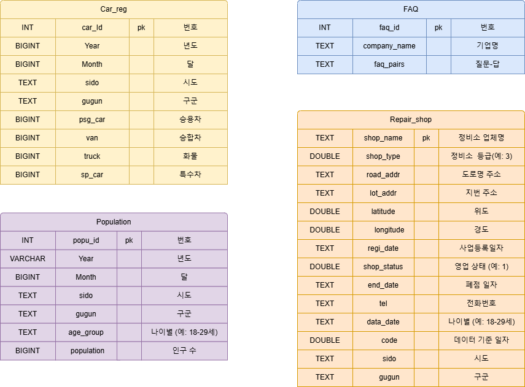
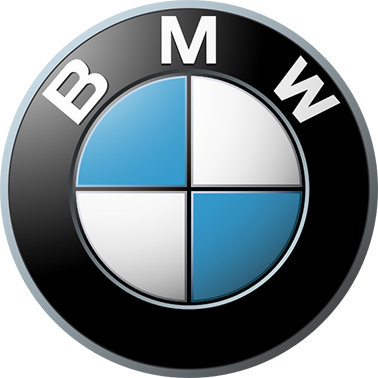
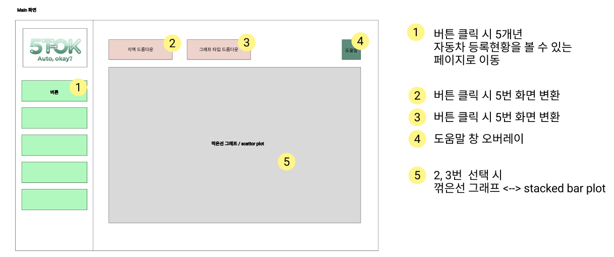
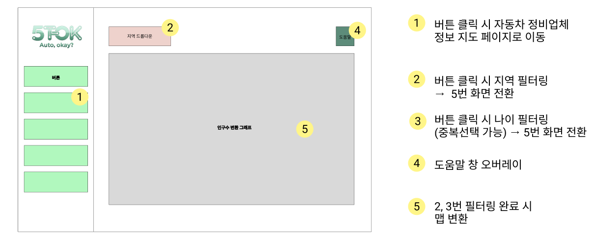
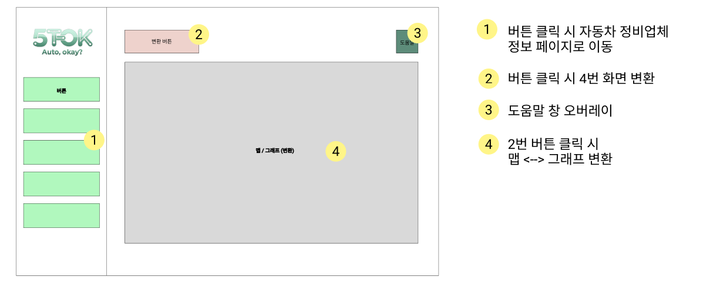
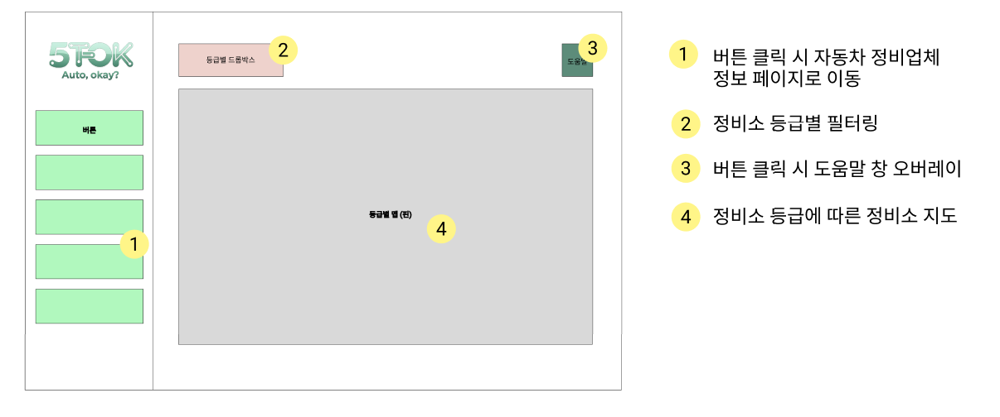
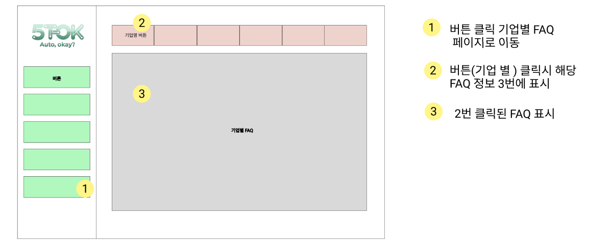

# 1. 팀 소개
| 박연정 / 팀원 | 박지현 / 팀원 | 여해준 / 팀원 | 이상민 / 팀장 | 이채림 / 팀원 |
|:--:|:--:|:--:|:--:|:--:|
|  |  |  |  |  |
| `@yeony-park` | `@qkrwlgus89` | `@inoocap-ux` | `@Sangmin630` | `@chaechae18` |
| 인구-차량 추이 페이지<br>FAQ 크롤링<br>공통 함수 모듈화 | 차량 등록 현황 페이지<br>데이터 수집 및 전처리 | 정비소 지도 페이지 <br>데이터 수집 및 전처리 | FAQ 페이지<br>FAQ 크롤링<br>공통 레이아웃 컴포넌트 | 정비소 인프라 현황 페이지<br>FAQ 크롤링<br>발표자료 |


# 2. 프로젝트 기간

- **2026.01.16 ~ 2026.01.19**

# 3. 프로젝트 개요
## 📕 프로젝트명
<div align="left">
  
</div>

## ✅ 프로젝트 배경 및 목적
자동차 등록 현황과 정비 인프라 간의 불균형을 데이터 기반으로 분석하여, 지역별 정비소 부족 문제를 시각화하고 개선 방안 마련의 기초 자료를 제공하는 것을 목표로 합니다.

## 🖐️ 프로젝트 소개
본 프로젝트는 다음과 같은 주요 기능을 제공합니다:

### 1.자동차 등록 현황 추이 분석
- (승용·승합·화물·특수) 등록 현황 시각화
- 월별/분기별 변화 추이 그래프
- 전국 시도별 데이터 필터링 기능

### 2. 인구-차량 추이 비교
- 지역별 인구 변화 추이 분석
- 인구수와 차량 등록 대수 간 상관관계 시각화
- 다중 지역 선택을 통한 비교 분석

### 3. 정비소 인프라 분석
- 차량 대비 정비소 비율 계산 및 지역별 부족도 시각화
- 지도 기반 정비소 분포 히트맵 제공
- 정비소 부족 단계(심각/부족/보통/정비소 없음) 색상 표시

### 4. 정비소 위치 정보
- 전국 정비소 위치 마커 클러스터 지도
- 정비업 종류(1급~4급)별 분류 및 범례 제공
- 정비소 상세 정보(업체명, 주소, 전화번호) 제공

### 5. 정비 FAQ
- 주요 자동차 브랜드별 정비 관련 FAQ 제공
- 키워드 검색 기능으로 원하는 정보 빠르게 찾기


## 👤 대상 사용자
- **정책 입안자** : 지역별 정비 인프라 현황을 파악하고 정책 수립에 활용
- **자동차 정비업 관계자** : 정비소 개설 지역 선정 시 참고 자료로 활용
- **일반 차량 소유자** : 거주 지역의 정비소 현황 확인
- **데이터 분석가** : 자동차 등록 및 인프라 관련 데이터 분석 자료로 활용

# 4. 수행 결과 (시연)
- 전국 분기별 차량 등록 현황
<p align="center">

</p>

- 인구 차량 추이
<p align="center">

</p>

- 정비소 인프라 현황
<p align="center">

</p>
- 정비소 지도
<p align="center">

</p>

- 정비 FAQ
<p align="center">

</p>

---

# 5. 프로젝트 설계
## 5.1 프로젝트 디렉토리 구조

```text
sk25-1st-5team/
├── .env                     # 로컬 환경변수 파일 (gitignore로 관리)
├── .gitignore               
├── app.py                   
├── README.md                
├── requirements.txt         
├── util.py                  # DB 데이터 조회/로딩 함수 모음
├── .streamlit/              # Streamlit 설정
│   └── config.toml
├── assets/                  # README/문서용 리소스
│   ├── docs/                # ERD, 화면설계서, 기능정의서 등 문서 이미지
│   │   ├── bmw.png
│   │   ├── chevrolet.png
│   │   ├── erd.png
│   │   ├── genesis.png
│   │   ├── hyundai.png
│   │   ├── kgm.png
│   │   ├── kia.png
│   │   ├── ui_function_p1_main.png
│   │   ├── ui_function_p2_population.png
│   │   ├── ui_function_p3_repair_ratio_map.png
│   │   ├── ui_function_p4_maintenance.png
│   │   └── ui_function_p5_faq.png
│   ├── screenshots/         # 실행 화면 캡처
│   └── team/                # 팀원 프로필 이미지
│       ├── 좀비(해준).jpg
│       ├── 초코(채림).jpg
│       ├── 택시(상민).jpg
│       ├── 햄버거(연정).jpg
│       └── 히터(지현).jpg
├── components/              # 공통 UI/레이아웃 컴포넌트
│   └── layout.py
├── data/                    # 프로젝트 데이터(CSV)
│   ├── Annual_Vehicle_Registrations.csv
│   ├── bmw_faq.csv
│   ├── chevrolet_faq.csv
│   ├── genesis_faq.csv
│   ├── hyundai_faq.csv
│   ├── kgm_faq.csv
│   ├── kia_faq.csv
│   ├── repair_shop_final.csv
│   └── total_population_2021_2025_final3.csv
├── img/
│   ├── autok_logo.png       # 로고 이미지
│   └── help.png
├── pages/                   # Streamlit 페이지 모음
│   ├── faq.py
│   ├── main.py
│   ├── maintenance.py
│   ├── population.py
│   └── repair_ratio_map.py
└── src/
    ├── crawler/             # FAQ 크롤러 스크립트
    │   ├── bmw_crawler.py
    │   ├── chevorlet_crawler.py
    │   ├── genesis_crawler.py
    │   ├── hyundai_crawler.py
    │   ├── kgm_crawler.py
    │   └── kia_crawler.py
    └── DB/                  # DB 테이블 생성 스크립트
        └── db_faq.py
```

## 5.2 ERD
<div align="left"> <a href="./assets/docs/erd.png">  </a> </div>

## 5.3 데이터 출처
본 프로젝트는 다음과 같은 데이터를 활용하여 구성되었습니다.

- **정비소 데이터**  
  공공데이터포털에서 제공하는  
  [전국자동차정비업체표준데이터](https://www.data.go.kr/data/15028204/standard.do#layer_data_infomation)를 활용하였습니다.

- **자동차 등록 데이터**  
  국토교통부 통계누리에서 제공하는  
  [자동차등록현황보고](https://stat.molit.go.kr/portal/cate/statMetaView.do?hRsId=58)를 활용하였습니다.

- **FAQ 데이터**
  자동차 관련 FAQ는 **총 6개 기업**의 공식 데이터를 수집·정리하여 활용하였습니다.</br>
            
  - [Hyundai](https://www.hyundai.com/kr/ko/faq.html)
  - [Kia](https://www.kia.com/kr/customer-service/center/faq)
  - [Genesis](https://www.genesis.com/kr/ko/support/faq.html)
  - [KGM](https://www.kg-mobility.com/sr/online-center/faq/detail?searchWord=&categoryCd=304)
  - [Chevrolet](https://www.chevrolet.co.kr/faq/product-maintenance)
  - [BMW](https://www.bmw.co.kr/kr/s/?language=ko)

## 5.4 화면·기능 설계서
### Main Page
<div align="left">
  <a href="./assets/docs/ui_function_p1_main.png">
    
  </a>
</div>

### Population Page
<div align="left">
  <a href="./assets/docs/ui_function_p2_population.png">
    
  </a>
</div>

### Repair Ratio Map Page
<div align="left">
  <a href="./assets/docs/ui_function_p3_repair_ratio_map.png">
    
  </a>
</div>

### Maintenance Page
<div align="left">
  <a href="./assets/docs/ui_function_p4_maintenance.png">
    
  </a>
</div>

### FAQ Page
<div align="left">
  <a href="./assets/docs/ui_function_p5_faq.png">
    
  </a>
</div>

---

# 6. 기술 스택
## 🛠️ Development
### Frontend & Visualization


### Backend & DB


### Web scrapping & Data processing


---

# 7. 한 줄 회고
> &nbsp;**박연정** : 데이터 수집부터 시각화까지 전과정에 참여해보면서, DB 설계의 중요성을 배웠다. 이 경험을 바탕으로 다음 프로젝트에서는 유기적인 ERD를 구성해봐야겠다.
> 요구 기능을 모두 구현해주는 팀원들과 함께할 수 있어서 즐거웠다.
>
> &nbsp;**박지현** : 비전공자로서 처음 다뤄보는 공공데이터와 시각화 작업이었지만, 데이터 구조를 이해하고 전처리 과정을 직접 설계하며 분석의 흐름을 배울 수 있었다.
>
> &nbsp;**여해준** : 첫 팀 프로젝트라 많이 긴장되었으나 데이터 전처리를 하며 기존에 배웠던 파이썬 코드들을 응용하고 적용하는 과정에서 데이터 전처리의 중요성을 다시 상기할 수 있었다.
>
> &nbsp;**이상민** : DB 연결 과정에서 테이블 간 관계를 명확히 정의하지 못해 ERD 설계가 유기적으로 이루어지지 못한 점이 아쉬웠지만, 첫 프로젝트를 통해 데이터 수집, 분석, 정리, 기능 구현까지 전반적인 과정을 직접 경험할 수 있었고, 다양한 역할을 수행해볼 수 있어 좋은 학습 기회가 되었다.
>
> &nbsp;**이채림** : 처음으로 데이터 수집부터 시각화까지 전 과정을 진행해 어려움도 있었지만 좋은 경험이었다. DB 설계 단계에서 확장성과 정규화를 충분히 고려하지 못한 점이 아쉬움으로 남아 추후에는 확장성과 활용성을 고려한 구조로 DB를 설계하고 싶다.
